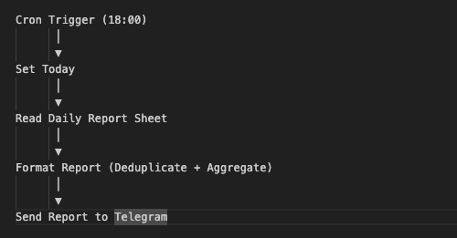
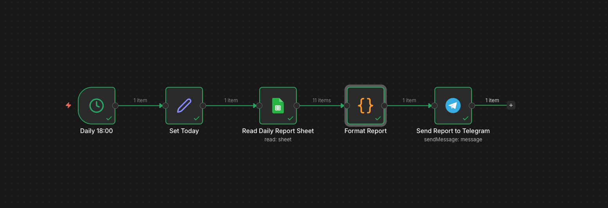
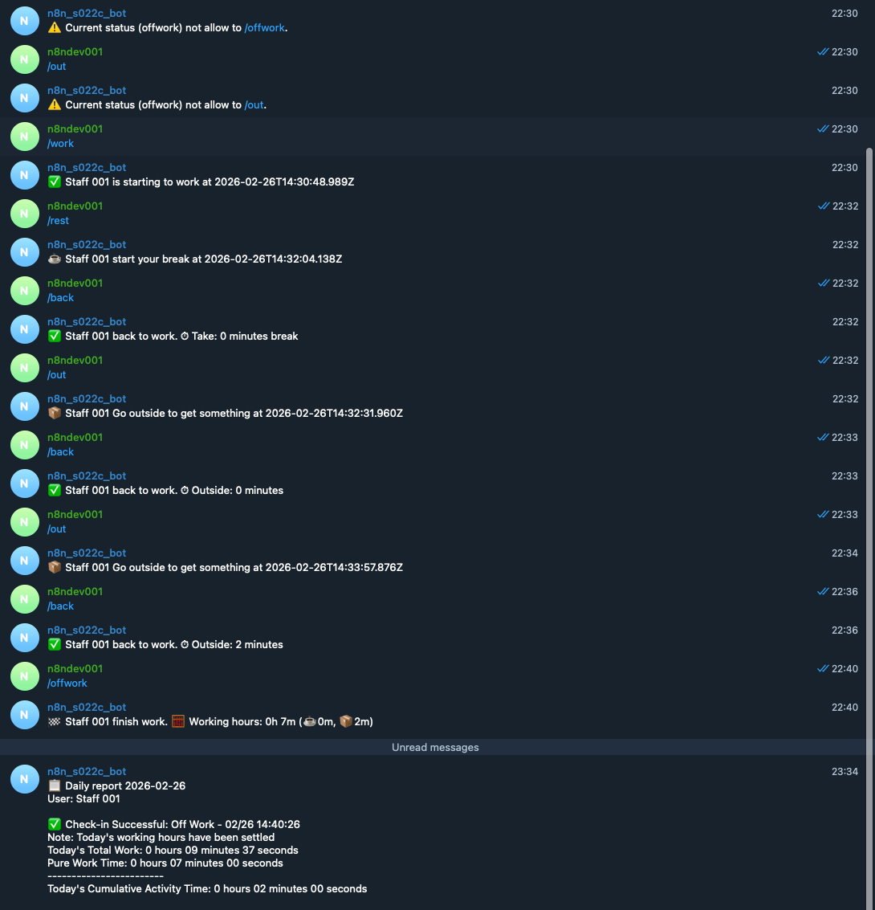

# Telegram Attendance System

Production-ready workflow automation systems built with n8n, Docker, Telegram Bot API, Google Sheets, and external APIs.

### 🚀 Projects
1️⃣ Telegram Attendance System
- State machine-based workforce tracking
- Anti-spam validation
- Real-time Telegram interaction
- Daily report automation
- Docker self-hosted deployment

Tech stack:
- n8n
- Docker
- PostgreSQL / Data Store
- Telegram Bot API
- Google Sheets API

### 🏗 System Architecture
#### Overview
The system is a Telegram-based workforce attendance automation platform built with n8n (self-hosted).
It consists of two independent workflows:
1. Real-time Attendance Processing Workflow
2. Daily Summary Report Workflow

#### 1️⃣ Real-Time Attendance Workflow

##### Flow Architecture


#### 2️⃣ Daily Summary Workflow (Scheduled)

##### Flow Architecture





#### 🐳 Deployment
```
docker compose up -d
```


#### 🖼 Demo


